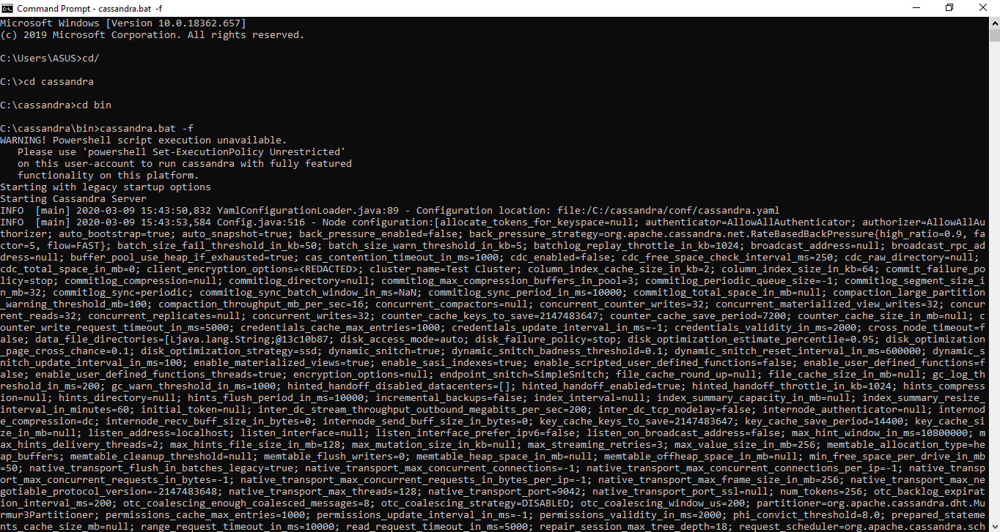
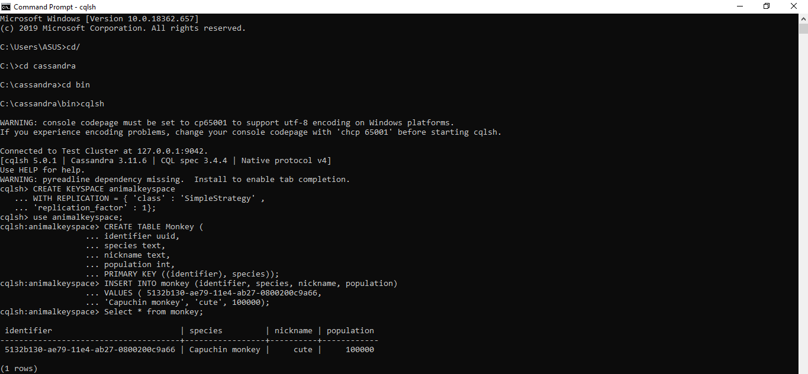

# PERTEMUAN 6 #

Nama : Indah Tri Apriliani
NIM  : 185610059

---

Latihan dan Tugas

Pada gambar 1 ini tertulis tahap-tahap lanjutan yang dilakukan untuk menginstal Apache Cassandra agar bisa dijalankan pada PC, setelah memasang JDK, python (saya memakai python versi 2.7) dan tentu saja Apache Cassandra pada PC sebelumnya. Langkah awal yang saya lakukan pada gambar diatas adalah membuka folder cassanda yang terdapat pada PC dengan mengetik "cd/" "cd cassandra" "cd bin" lalu menjalankan Cassandra Server dengan mengetik "cassandra.bat -f" menggunakan CMD Run. Lalu akan muncul tampilan seperti diatas, tanda bahwa Apache Cassandra berhasil di instal pada PC.

Pada gambar 2 saya membuka jendela baru CMD Run dan membuka kembali folder cassandra pada PC seperti pada gambar 1. Lalu untuk menjalankan cqlsh (Cassandra Query Shell), saya mengetik "cqlsh" dan kemudian akan muncul tampilan seperti pada gambar. Setelah cqlsh bisa dijalannkan, saya mengerjakan latihan menggunakan cqlsh untuk membuat CRUD, seperti yang terlihat juga pada gambar. Pada gambar terlihat saya membuat kelas "animalkeyspace" dan menggunakannya untuk praktik kali ini. Didalam kelas tersebut saya membuat tabel "Monkey" dan menambahkan data pada tabel tersebut dengan menggunakan perintah "INSERT". Lalu data yang telah dimasukan pada tabel bisa dilihat hasilnya dengan menggunakan perintah "SELECT", contoh hasilnya akan terlihat seperti pada gambar. 

Pada gambar 3 merupakan lanjutan dari contoh praktik menggunakan cqlsh untuk membuat kelas yang terdapat tabel berisi data diatas. Pada gambar 3 terlihat perintah untuk menambahkan lagi data baru pada tabel yang sudah dibuat sebelumnya dengan menggunakan perintah "INSERT". Dan kemudian bisa dilihat kembali hasilnya dengan menggunakan "SELECT" seperti pada gambar diatas.

---

